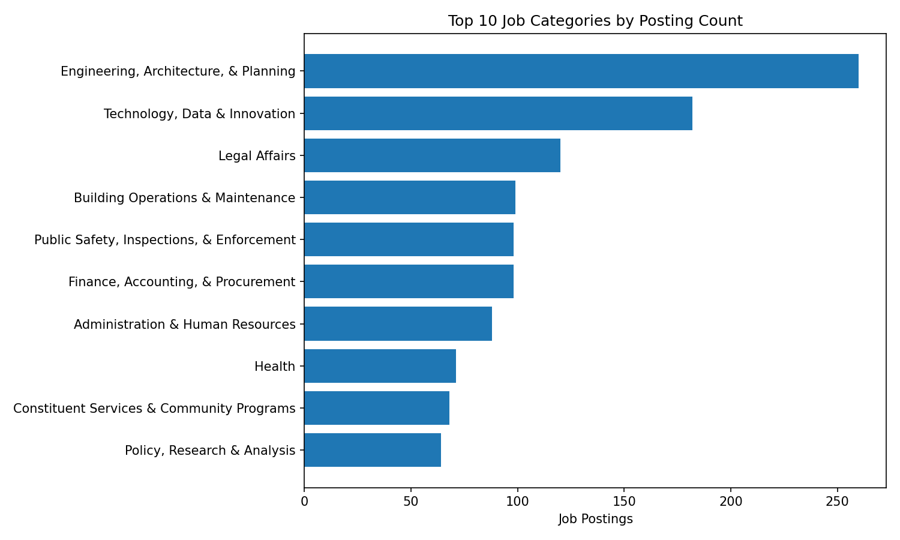
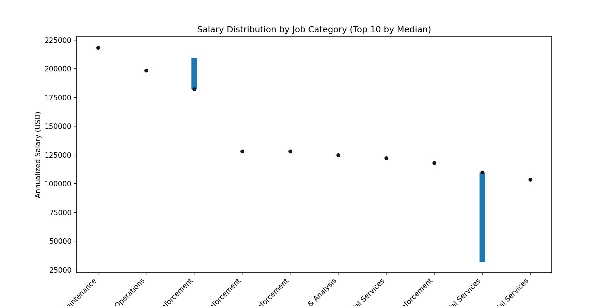
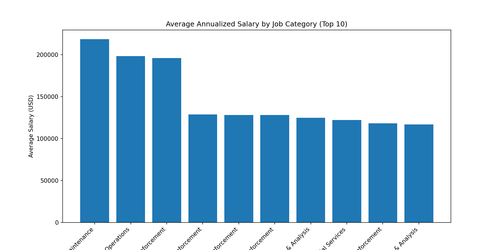
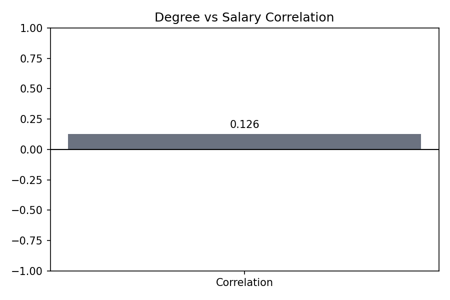
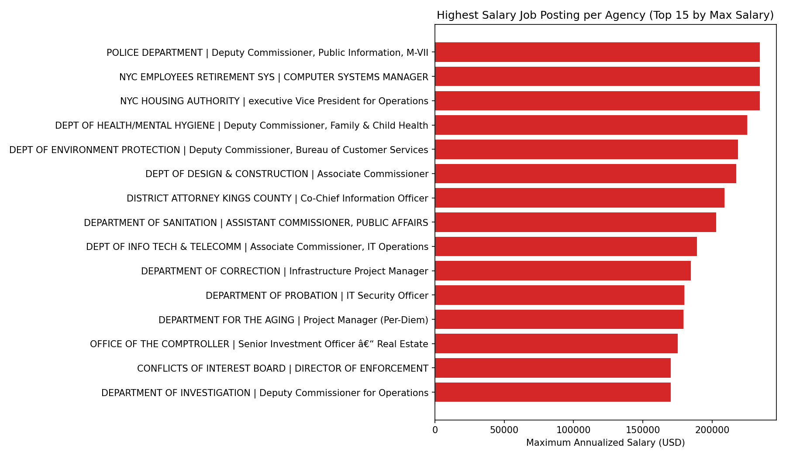
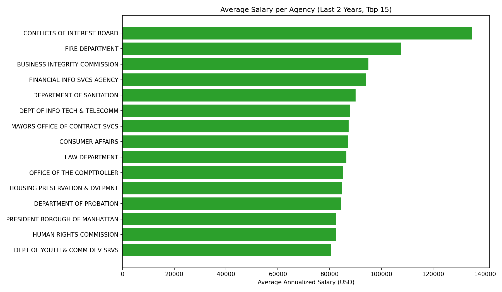
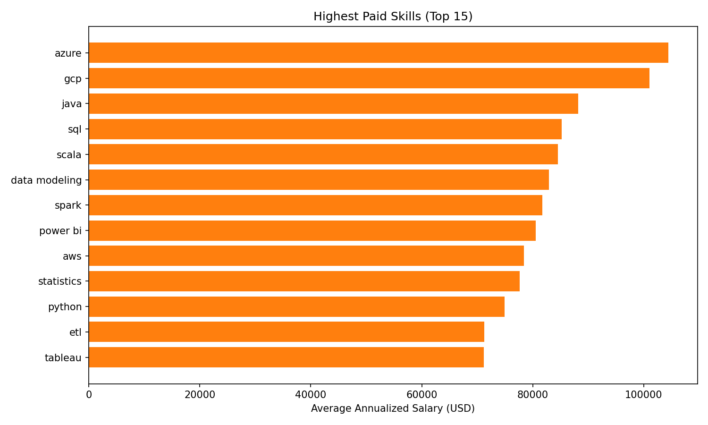

# KPI Visual Report

This report contains KPI visuals generated from the PySpark pipeline output.

## 1) Number of job postings per category (Top 10)

## 2) Salary distribution per job category

## 3) Correlation between higher degree and salary

## 4) Highest salary job posting per agency

## 5) Average salary per agency for last 2 years

## 6) Highest paid skills in the market

